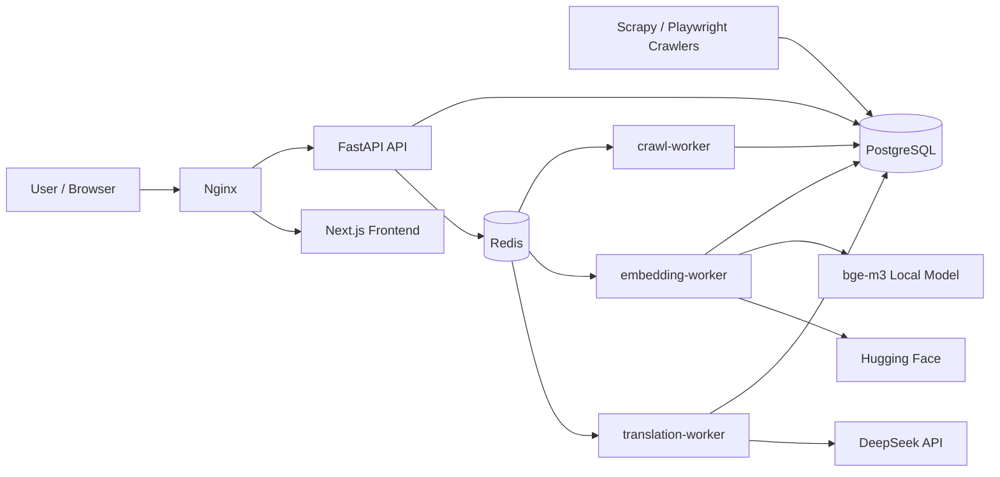
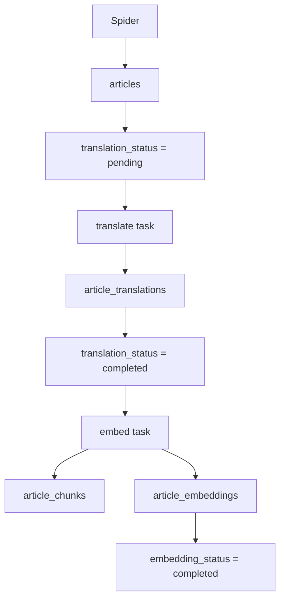
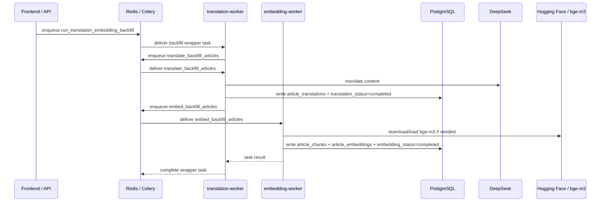

# Pipeline Architecture

## Overview

The system is organized into four layers:

1. Crawling
2. Task orchestration
3. Processing
4. Delivery

Core components:

- Crawlers: `Scrapy + Playwright`
- Broker / result backend: `Redis`
- Task system: `Celery`
- Main database: `PostgreSQL`
- API: `FastAPI`
- Frontend: `Next.js`
- Entry proxy: `Nginx`

## High-Level Architecture

## Data Flow

## Queue Layout

Celery queue routing is defined in [pipeline/celery_app.py](/home/fanhe/NingTai/news_data/pipeline/celery_app.py).

- `crawl`
  - `pipeline.tasks.crawl.*`
- `translate`
  - `pipeline.tasks.translate.*`
- `embed`
  - `pipeline.tasks.embed.*`
- `default`
  - orchestration and backfill wrapper tasks

Current workers:

- `translation-worker`
  - listens to `default,translate`
- `embedding-worker`
  - listens to `embed`
- `crawl-worker`
  - used for crawl tasks

## Backfill Dispatch Flow

`POST /api/v1/pipeline/backfill` creates a Celery task:

- `pipeline.tasks.backfill.run_translation_embedding_backfill`

That wrapper task is consumed by `translation-worker` from the `default` queue, then dispatches sub-tasks in sequence:

1. `pipeline.tasks.translate.translate_backfill_articles`
   - queue: `translate`
   - consumed by `translation-worker`
2. `pipeline.tasks.embed.embed_backfill_articles`
   - queue: `embed`
   - consumed by `embedding-worker`

## Current Execution Semantics

Backfill is currently batch-serial at the wrapper level:

1. Finish the translation sub-task for the requested batch
2. Then start the embedding sub-task for the requested batch

This means:

- translation does not continue growing forever inside one backfill run
- once `translate_limit` is reached, the wrapper waits for embedding
- the UI may show translation numbers paused while embedding is still running

## Status Fields

Main article states live in `articles`:

- `translation_status`
  - `pending`
  - `processing`
  - `completed`
  - `failed`
- `embedding_status`
  - `pending`
  - `processing`
  - `completed`
  - `failed`

Supporting tables:

- `article_translations`
- `article_chunks`
- `article_embeddings`
- `pipeline_task_runs`
- `crawl_jobs`

## Why Embedding May Appear Slow

The first local embedding run may spend time on:

- loading `sentence-transformers`
- downloading `BAAI/bge-m3` from Hugging Face
- initializing the model in the worker process

During that period:

- `translation_completed` may already stop increasing for the current batch
- `embedding_completed` may still remain unchanged
- the wrapper task will still show `STARTED`

## Relevant Files

- API
  - [api/main.py](/home/fanhe/NingTai/news_data/api/main.py)
- Celery config
  - [pipeline/celery_app.py](/home/fanhe/NingTai/news_data/pipeline/celery_app.py)
- Backfill wrapper
  - [pipeline/tasks/backfill.py](/home/fanhe/NingTai/news_data/pipeline/tasks/backfill.py)
- Translation tasks
  - [pipeline/tasks/translate.py](/home/fanhe/NingTai/news_data/pipeline/tasks/translate.py)
- Embedding tasks
  - [pipeline/tasks/embed.py](/home/fanhe/NingTai/news_data/pipeline/tasks/embed.py)
- LLM / embedding client
  - [pipeline/llm_client.py](/home/fanhe/NingTai/news_data/pipeline/llm_client.py)
- Unified schema
  - [migrations/000001_unified_news_schema.sql](/home/fanhe/NingTai/news_data/migrations/000001_unified_news_schema.sql)
